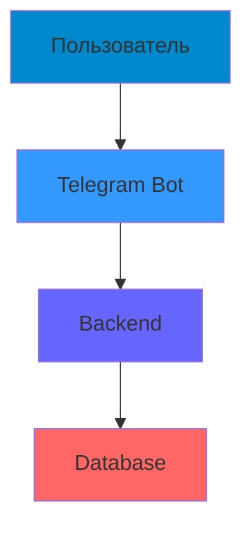

# SorryFast


---

## 📑 Быстрая навигация

| Раздел | Описание |
|--------|-----------|
| [🎯 О проекте](#-о-проекте) | Основная информация |
| [👥 Команда](#-команда) | Состав команды и роли |
| [🚀 Возможности](#-возможности) | Ключевые функции бота |
| [🏗 Архитектура](#-архитектура) | Схема работы системы |
| [⚙️ Установка](#-установка) | Быстрый старт |
| [💼 Ценность](#-ценность) | Бизнес-преимущества |
| [📊 Критерии](#-критерии) | Показатели успеха |
| [🎪 Демо](#-демо) | Тестовый бот |
| [📞 Контакты](#-контакты) | Связь с разработчиками |

---

## 🎯 О проекте

**VTB Analytics Bot** — Telegram-бот, который наглядно сравнивает производительность CRUD-операций и оптимизированных аналитических запросов в PostgreSQL.

## 📊 Презентация проекта

*[📑 Смотреть полную презентацию на Figma](https://www.figma.com/slides/a1OY0tuPBMSeg5jRomcOfM/Untitled?node-id=1-87&t=z8d3SaNISpJc5qmD-1)**

[⬆ Наверх](#vtb-analytics-bot)

---

## 👥 Команда

| Роль | Участник | Вклад |
|------|----------|--------|
| **Backend/Database Developer** | Артём Фролов; Пётр Шибанов |Разработка логики миграции данных; Работа с PostgreSQL утилитами (pg_dump, psql, COPY); Оптимизация SQL-запросов для частичного переноса |
| **DevOps/System Engineer** | Лев Примак |Реализация многопоточности в bash; Настройка параллельной обработки(GNU Parallel, background jobs); Оптимизация производительности и тестирование нагрузки |
| **Configuration & Testing Engineer** | Реваль Садрисламов |Разработка формата и парсера конфигурационного файла; Создание тестовых сценариев и данных; Валидация корректности миграции |
| **Technical Writer / Project Manager** | Никита Ларионов | Координация работы команды; Написание документации и примеров использования; Тестирование user experience CLI-утилиты |

[⬆ Наверх](#vtb-analytics-bot)

---

## 🚀 Возможности
-
[⬆ Наверх](#vtb-analytics-bot)

---

## 🏗 Архитектура



**Компоненты:**
- `tg_bot/` — Telegram-бот
- `backend/` — Сервис аналитики и работы с бд


[⬆ Наверх](#vtb-analytics-bot)

---

## ⚙️ Установка

### Требования:
- 🐳 **Docker** и **Docker Compose**
- 🤖 **Telegram Bot Token**

### Установка и запуск:

1. **Клонирование репозитория**
   ```bash
   git clone https://github.com/Furlos/SorryFast
   cd SorryFast
   ```

2. **Настройка окружения**
   ```bash
   # Укажите свой токен в docker-compose.yml
   BOT_TOKEN="your_telegram_bot_token"
   ```

3. **Запуск системы**
   ```bash
   docker-compose up --build
   ```

[⬆ Наверх](#vtb-analytics-bot)

---

## 💼 Ценность
-
[⬆ Наверх](#vtb-analytics-bot)

---

## 📊 Критерии
-
[⬆ Наверх](#vtb-analytics-bot)

---

## 🎪 Демо

**Telegram бот:** [@SorryFast_bot](https://t.me/SorryFast_bot)

[⬆ Наверх](#vtb-analytics-bot)

---

## 📞 Контакты

**Техническая поддержка:**  
👨‍💻 **Lev Primak (Furlos)** — [@Fyrlosik](https://t.me/Fyrlosik)

[⬆ Наверх](#vtb-analytics-bot)

---

*VTB Analytics Bot — умные решения для вашего бизнеса* 🚀


