# PostgreSQL Workload Analyzer Telegram Bot

🤖 **Telegram бот для анализа профилей нагрузки PostgreSQL**  
*AI-помощник для определения типа нагрузки и оптимизации производительности СУБД*

## 🎯 О проекте

Микросервис Telegram бота, который анализирует SQL-запросы к PostgreSQL, определяет профиль нагрузки (OLTP, OLAP, IoT, Mixed и др.) и выдает рекомендации по оптимальным настройкам для максимальной производительности.

Разработан в рамках хакатона ВТБ для трека "Алгоритм определения профиля нагрузки PostgreSQL".

## 📊 Поддерживаемые профили нагрузки

- ⚡ **OLTP** (Online Transaction Processing) - транзакционные операции
- 📈 **OLAP** (Online Analytical Processing) - аналитические запросы  
- 🔄 **Mixed** - смешанная нагрузка OLTP/OLAP
- 🌐 **IoT/Телеметрия** - массовая запись данных
- 📖 **Read-Intensive** - преобладание операций чтения
- ✍️ **Write-Intensive** - преобладание операций записи
- 💻 **Web Service** - интерактивные веб-сервисы
- ⚙️ **Batch Processing** - пакетная обработка
# PostgreSQL Workload Analyzer Telegram Bot

🤖 **Telegram бот для анализа профилей нагрузки PostgreSQL**  
*AI-помощник для определения типа нагрузки и оптимизации производительности СУБД*

## 🎯 О проекте

Микросервис Telegram бота, который анализирует SQL-запросы к PostgreSQL, определяет профиль нагрузки (OLTP, OLAP, IoT, Mixed и др.) и выдает рекомендации по оптимальным настройкам для максимальной производительности.

Разработан в рамках хакатона ВТБ для трека "Алгоритм определения профиля нагрузки PostgreSQL".

## 📊 Поддерживаемые профили нагрузки

- ⚡ **OLTP** (Online Transaction Processing) - транзакционные операции
- 📈 **OLAP** (Online Analytical Processing) - аналитические запросы  
- 🔄 **Mixed** - смешанная нагрузка OLTP/OLAP
- 🌐 **IoT/Телеметрия** - массовая запись данных
- 📖 **Read-Intensive** - преобладание операций чтения
- ✍️ **Write-Intensive** - преобладание операций записи
- 💻 **Web Service** - интерактивные веб-сервисы
- ⚙️ **Batch Processing** - пакетная обработка

## 🔄 Взаимодействие пользователя с ботом

```mermaid
graph TB
    Start([Start]) --> Menu["📋 Главное меню"]
    Menu --> LoadProfile["⚡ Выбор профиля нагрузки"]
    LoadProfile --> Analysis["🔍 Анализ нагрузки"]
    Analysis --> Result["📊 Результат анализа"]
    Result --> Menu2["← Назад в главное меню"]
    Menu2 --> Menu
    
    style Start fill:#90EE90
    style Menu fill:#87CEEB
    style LoadProfile fill:#FFB6C1
    style Analysis fill:#DDA0DD
    style Result fill:#F0E68C
    style Menu2 fill:#87CEEB
```

